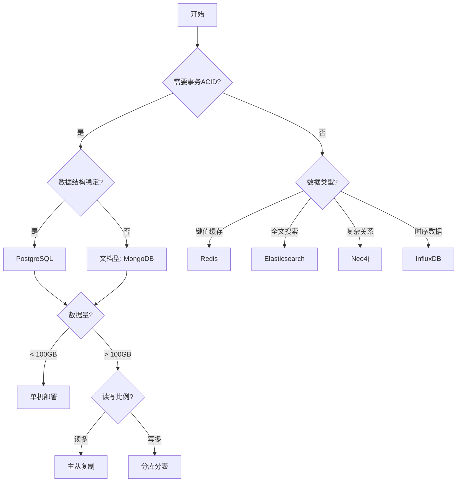

## 前言

在日常开发中，我们几乎每天都在和数据库打交道：存储用户信息、记录订单数据、缓存热点数据、搜索商品信息...但你真的理解数据库吗？

为什么有了文件系统还需要数据库？PostgreSQL、MongoDB、Redis 这些数据库有什么区别？什么时候该用哪种数据库？

本文将从零开始，带你理解数据库的核心概念，为后续深入学习打下坚实基础。

---

## 核心概念

### 什么是数据库？

**数据库（Database）**是有组织的数据集合，它通过**数据库管理系统（DBMS）**进行管理。简单来说，数据库就是一个电子化的文件柜，让我们能够高效地存储、检索和管理数据。

**核心优势**：

- **数据持久化**：程序关闭后数据不丢失
- **高效查询**：快速找到需要的数据
- **并发控制**：多个用户同时访问不会冲突
- **数据完整性**：保证数据的准确性和一致性
- **安全性**：控制谁可以访问什么数据

---

### 数据库发展史

了解数据库的演进，有助于我们理解不同数据库的设计初衷。

```
┌─────────────────────────────────────────────────────────────┐
│                     数据库发展历程                            │
├─────────────────────────────────────────────────────────────┤
│                                                             │
│  1960s: 文件系统                                             │
│  └─ 数据分散在各个文件中，缺乏统一管理                         │
│                                                             │
│  1970s: 层次/网状数据库                                       │
│  └─ IMS（层次型）、IDS（网状型）- 结构复杂，不易使用            │
│                                                             │
│  1980s: 关系型数据库（RDBMS）兴起                              │
│  └─ Oracle、MySQL、PostgreSQL - SQL 语言，表格结构             │
│                                                             │
│  1990s: 面向对象数据库                                        │
│  └─ 试图融合面向对象编程，但未成为主流                          │
│                                                             │
│  2000s: NoSQL 革命                                           │
│  └─ MongoDB（文档）、Redis（键值）、Cassandra（列族）           │
│      - 应对大数据量、高并发场景                                │
│                                                             │
│  2010s: NewSQL 与混合架构                                     │
│  └─ 兼顾 SQL 的易用性和 NoSQL 的扩展性                         │
│      - 分布式数据库、多语言持久化                              │
│                                                             │
│  2020s: 云原生数据库                                          │
│  └─ Aurora、Spanner、Cloud SQL - Serverless、自动扩展         │
│                                                             │
└─────────────────────────────────────────────────────────────┘
```

---

### 数据库分类

数据库按**数据模型**可以分为几大类，每种都有其适用场景。

#### **1. 关系型数据库（RDBMS）**

**特点**：数据以**表格（Table）**形式存储，表之间通过**外键**建立关系。

**代表产品**：

- **PostgreSQL**：功能最强大的开源数据库
- **MySQL**：最流行的开源数据库
- **SQLite**：嵌入式数据库，零配置

**适用场景**：

- ✅ 需要事务支持（ACID）
- ✅ 数据结构稳定，模式固定
- ✅ 需要复杂查询（JOIN、聚合）
- ✅ 对数据一致性要求高

**典型应用**：电商系统、金融系统、企业管理系统

#### **2. 文档型数据库**

**特点**：存储 **JSON/BSON** 格式的文档，schema-less（无需预定义结构）。

**代表产品**：

- **MongoDB**：最流行的文档数据库
- **CouchDB**：支持离线同步

**适用场景**：

- ✅ 数据结构灵活多变
- ✅ 需要快速迭代开发
- ✅ 内容管理、日志存储
- ✅ 嵌套文档结构

**典型应用**：内容管理系统、用户画像、日志分析

#### **3. 键值型数据库**

**特点**：通过**键（Key）**快速访问**值（Value）**，性能极高。

**代表产品**：

- **Redis**：功能丰富的内存数据库
- **Memcached**：简单的缓存系统

**适用场景**：

- ✅ 缓存（热点数据）
- ✅ 会话存储
- ✅ 排行榜、计数器
- ✅ 消息队列

**典型应用**：缓存层、实时统计、分布式锁

#### **4. 列族型数据库**

**特点**：数据按**列**存储，适合大数据量、写密集场景。

**代表产品**：

- **Cassandra**：高可用、无单点故障
- **HBase**：Hadoop 生态系统

**适用场景**：

- ✅ 海量数据存储（PB 级）
- ✅ 高并发写入
- ✅ 时序数据
- ✅ 日志存储

**典型应用**：物联网、监控系统、推荐系统

#### **5. 搜索引擎**

**特点**：专门优化**全文搜索**和**复杂查询**。

**代表产品**：

- **Elasticsearch**：基于 Lucene
- **Solr**：企业级搜索平台

**适用场景**：

- ✅ 全文搜索
- ✅ 日志分析（ELK Stack）
- ✅ 数据分析可视化

**典型应用**：站内搜索、日志分析、监控告警

#### **6. 图数据库**

**特点**：专门存储**图结构**（节点和边），擅长处理复杂关系。

**代表产品**：

- **Neo4j**：最流行的图数据库
- **ArangoDB**：多模型数据库

**适用场景**：

- ✅ 社交网络（好友关系）
- ✅ 知识图谱
- ✅ 推荐引擎（图遍历）
- ✅ 欺诈检测

**典型应用**：社交网络、推荐系统、知识图谱

---

## ACID 特性

**ACID** 是关系型数据库保证数据可靠性的四大特性，理解它对数据库设计至关重要。

### 1. 原子性（Atomicity）

**定义**：事务中的所有操作要么**全部成功**，要么**全部失败**。

**实例**：银行转账

```sql
BEGIN;

-- 从账户 A 扣除 100 元
UPDATE accounts SET balance = balance - 100 WHERE id = 'A';

-- 向账户 B 增加 100 元
UPDATE accounts SET balance = balance + 100 WHERE id = 'B';

COMMIT;  -- 如果任何一步失败，整个事务回滚
```

如果第二个 UPDATE 失败，第一个操作也会回滚，不会出现钱扣了但没收到的情况。

### 2. 一致性（Consistency）

**定义**：事务执行前后，数据库都必须处于**一致的状态**。

**实例**：库存管理

```sql
-- 约束：库存不能为负数
ALTER TABLE products ADD CONSTRAINT check_stock CHECK (stock >= 0);

BEGIN;
UPDATE products SET stock = stock - 10 WHERE id = 'p1';
-- 如果 stock - 10 < 0，事务会失败
COMMIT;
```

### 3. 隔离性（Isolation）

**定义**：多个事务并发执行时，每个事务都感觉不到其他事务的存在。

**问题**：如果不隔离，会出现：

- **脏读**：读到未提交的数据
- **不可重复读**：同一查询两次结果不同
- **幻读**：查询范围数据时，其他事务插入了新行

**隔离级别**（PostgreSQL）：

```sql
-- 默认：读已提交
SET TRANSACTION ISOLATION LEVEL READ COMMITTED;

-- 更严格：可重复读
SET TRANSACTION ISOLATION LEVEL REPEATABLE READ;

-- 最严格：可串行化
SET TRANSACTION ISOLATION LEVEL SERIALIZABLE;
```

### 4. 持久性（Durability）

**定义**：事务一旦提交，数据就会**永久保存**，即使系统崩溃也不会丢失。

**实现**：通过 **WAL（Write-Ahead Logging）** 实现，先写日志再写数据。

---

## CAP 定理与 BASE 理论

对于分布式数据库，ACID 可能无法完全满足，于是有了 CAP 和 BASE。

### CAP 定理

分布式系统只能同时满足以下三个特性中的**两个**：

| 特性                | 说明                       | 例子       |
| ------------------- | -------------------------- | ---------- |
| **C（一致性）**     | 所有节点同时看到相同的数据 | PostgreSQL |
| **A（可用性）**     | 每个请求都能得到响应       | Redis      |
| **P（分区容错性）** | 系统在网络分区时仍能运行   | Cassandra  |

**权衡**：

- **CA**：传统单机数据库（PostgreSQL、MySQL）
- **AP**：强调可用性（Cassandra、DynamoDB）
- **CP**：强调一致性（MongoDB、HBase）

### BASE 理论

BASE 是 ACID 的**反向思维**，放弃强一致性，追求**最终一致性**。

| 特性                      | 说明                         |
| ------------------------- | ---------------------------- |
| **Basically Available**   | 基本可用，允许部分失败       |
| **Soft state**            | 状态可以随时间变化           |
| **Eventually consistent** | 最终一致，短时间不一致可接受 |

**实例**：社交媒体的点赞数

- 用户点赞后，数可能不会立即更新
- 但几秒钟后，所有用户看到的数字一致

---

## 实战演练：演示 ACID 特性

让我们通过一个电商订单场景，演示数据库的 ACID 特性。

### 示例 1：原子性保证

```sql
-- 创建订单表
CREATE TABLE orders (
  id SERIAL PRIMARY KEY,
  user_id INTEGER NOT NULL,
  total NUMERIC(10, 2) NOT NULL,
  status VARCHAR(20) DEFAULT 'pending',
  created_at TIMESTAMP DEFAULT CURRENT_TIMESTAMP
);

-- 创建库存表
CREATE TABLE inventory (
  product_id INTEGER PRIMARY KEY,
  stock INTEGER NOT NULL CHECK (stock >= 0),
  version INTEGER DEFAULT 0  -- 乐观锁版本号
);

-- 插入测试数据
INSERT INTO inventory (product_id, stock) VALUES (1, 100);

-- 原子性事务：下单扣库存
BEGIN;

-- 1. 创建订单
INSERT INTO orders (user_id, total)
VALUES (123, 99.99)
RETURNING id;

-- 2. 扣减库存（假设订单 ID 为 1）
UPDATE inventory
SET stock = stock - 1, version = version + 1
WHERE product_id = 1 AND stock >= 1;

-- 检查库存是否足够
-- 如果 stock - 1 < 0，UPDATE 会失败，整个事务回滚

COMMIT;
```

### 示例 2：隔离级别测试

```sql
-- 终端 1：开启事务
BEGIN;
UPDATE inventory SET stock = stock - 10 WHERE product_id = 1;
-- 不提交，保持事务打开

-- 终端 2：在 READ COMMITTED 级别下
SET TRANSACTION ISOLATION LEVEL READ COMMITTED;
BEGIN;
SELECT stock FROM inventory WHERE product_id = 1;
-- 看到的是旧数据（终端 1 未提交）

-- 终端 1：提交
COMMIT;

-- 终端 2：再次查询
SELECT stock FROM inventory WHERE product_id = 1;
-- 现在看到新数据（已提交）
COMMIT;
```

---

## 如何选择数据库？

面对众多数据库，如何为项目选择合适的？以下决策树供参考：



### 实际选型建议

**1. 通用业务系统**（首选）

```yaml
推荐: PostgreSQL 16
理由:
  - 功能最强大（JSON、数组、全文搜索）
  - ACID 完整支持
  - 社区活跃，文档完善
  - 适合大多数场景
```

**2. 简单项目 / 学习**

```yaml
推荐: SQLite
理由:
  - 零配置，单文件
  - 适合小型应用
  - 手机应用本地存储
```

**3. 缓存层**

```yaml
推荐: Redis
理由:
  - 性能极高（10万+ QPS）
  - 丰富的数据结构
  - 持久化支持
```

**4. 内容管理 / 日志**

```yaml
推荐: MongoDB
理由:
  - Schema 灵活
  - 快速迭代
  - 水平扩展
```

**5. 全文搜索**

```yaml
推荐: Elasticsearch
理由:
  - 强大的搜索能力
  - 中文分词支持
  - 聚合分析
```

### 多语言持久化（Polyglot Persistence）

现代应用通常**组合多种数据库**，各司其职：

```yaml
电商系统架构:
  主数据库: PostgreSQL（用户、订单、商品）
  缓存层: Redis（会话、热点数据）
  搜索引擎: Elasticsearch（商品搜索）
  文档存储: MongoDB（商品详情、用户评论）
  消息队列: Redis（异步任务）
```

**核心原则**：

- **事务性数据** → PostgreSQL
- **热点数据** → Redis
- **灵活文档** → MongoDB
- **全文搜索** → Elasticsearch

---

## 最佳实践

### 1. 优先选择关系型数据库

如果你的需求不明确，**PostgreSQL** 是最安全的选择。它足够强大，能应对大多数场景。

### 2. 不要过早优化

小规模应用（< 10万用户）不需要复杂的分库分表，做好索引优化足够了。

### 3. 理解 CAP 权衡

- **金融系统**：一致性优先（CP/CA）
- **社交应用**：可用性优先（AP）
- **电商系统**：最终一致性可接受（BASE）

### 4. 缓存不能替代数据库

缓存是**补充**，不是替代。数据库才是数据的唯一真实来源（Source of Truth）。

### 5. 选择社区活跃的数据库

- 检查最后更新时间
- 查看 GitHub Stars
- 阅读问题讨论

---

## 常见问题

### Q1: MongoDB 能完全替代 PostgreSQL 吗？

**不能**。MongoDB 适合灵活文档，但缺乏：

- 真正的 ACID 事务（4.0 后有但不完善）
- 复杂查询（JOIN 能力弱）
- 数据约束（外键、检查约束）

### Q2: Redis 既然很快，为什么不用它做主数据库？

**Redis 不适合**：

- 数据持久化不可靠（RDB/AOF 可能丢失数据）
- 内存成本高
- 缺乏查询能力（不支持复杂查询）

### Q3: 为什么 PostgreSQL 比 MySQL 强？

PostgreSQL 的优势：

- 更丰富的数据类型（JSON/UUID/数组）
- 更强大的索引（GIN/GiST）
- 完整的 ACID 支持
- 更好的并发控制（MVCC）

### Q4: 什么时候该分库分表？

**指标**：

- 单表超过 **1000万**行
- 数据库超过 **100GB**
- QPS 超过单机承受能力

**注意**：分库分表是最后手段，先优化查询和索引。

---

## 总结

本文介绍了数据库的核心概念：

| 要点           | 关键内容                                           |
| -------------- | -------------------------------------------------- |
| **数据库分类** | 关系型、文档型、键值型、列族型、搜索引擎、图数据库 |
| **ACID 特性**  | 原子性、一致性、隔离性、持久性                     |
| **CAP 定理**   | 一致性、可用性、分区容错性只能三选二               |
| **选型原则**   | 优先 PostgreSQL，按需组合其他数据库                |

### 记住这些

1. ✅ **PostgreSQL** 是最安全的选择
2. ✅ **Redis** 适合缓存，不适合做主数据库
3. ✅ **ACID** 保证数据可靠性
4. ✅ **CAP** 是分布式系统的权衡
5. ✅ 不要过早优化，小项目不需要分库分表

---

## 下一步

现在你已经理解了数据库的基本概念，下一篇文章我们将学习 **SQL 语言基础**，掌握数据库查询的核心技能。

准备好了吗？让我们继续这个数据库学习之旅！ 🚀
