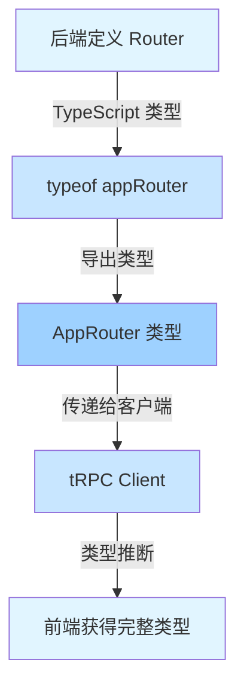

## 前言

你可能听说过"端到端类型安全"，但它到底意味着什么？为什么 tRPC 能做到其他工具做不到的事情？

答案就在 TypeScript 的**类型推断**系统。今天，我们将深入探索 tRPC 的魔法，看看类型是如何从后端"穿越"到前端的。

## 类型推断机制

### 工作原理图解



### 关键：typeof 操作符

tRPC 的魔法核心是 TypeScript 的 `typeof` 操作符：

```typescript
// ========== 后端 ==========

// 1. 定义 Router
export const appRouter = t.router({
  getUser: t.procedure
    .input(z.object({ id: z.string() }))
    .query(({ input }) => {
      return {
        id: input.id,
        name: "Alice",
        email: "alice@example.com",
        age: 28,
      };
    }),
});

// 2. 使用 typeof 提取类型
export type AppRouter = typeof appRouter;

// ========== 前端 ==========

// 3. 将类型传递给客户端
const client = createTRPCProxyClient<AppRouter>({
  links: [httpBatchLink({ url: "/api/trpc" })],
});

// 4. ✨ 魔法发生！完整的类型推断
const user = await client.getUser.query({ id: "123" });
// TypeScript 知道 user 的类型是：
// { id: string; name: string; email: string; age: number }
```

### 类型推断流程

#### 步骤1：后端定义

```typescript
import { initTRPC } from "@trpc/server";
import { z } from "zod";

const t = initTRPC.create();

// 定义一个复杂的 Router
export const appRouter = t.router({
  // 用户管理
  users: t.router({
    list: t.procedure.query(async () => {
      return await db.user.findMany();
      // TypeScript 推断返回：User[]
    }),

    byId: t.procedure
      .input(z.object({ id: z.string() }))
      .query(async ({ input }) => {
        return await db.user.findUnique({
          where: { id: input.id },
        });
        // TypeScript 推断返回：User | null
      }),

    create: t.procedure
      .input(
        z.object({
          name: z.string(),
          email: z.string().email(),
        })
      )
      .mutation(async ({ input }) => {
        return await db.user.create({ data: input });
        // TypeScript 推断返回：User
      }),
  }),

  // 文章管理
  posts: t.router({
    list: t.procedure
      .input(
        z.object({
          limit: z.number().default(10),
          cursor: z.string().optional(),
        })
      )
      .query(async ({ input }) => {
        return {
          items: await db.post.findMany({
            take: input.limit,
            cursor: input.cursor ? { id: input.cursor } : undefined,
          }),
          nextCursor: "abc123",
        };
        // TypeScript 推断返回：
        // {
        //   items: Post[];
        //   nextCursor: string | undefined;
        // }
      }),
  }),
});
```

#### 步骤2：导出类型

```typescript
// ✅ 关键：使用 typeof 导出完整类型
export type AppRouter = typeof appRouter;

// 这个类型包含了：
// - 所有 Router 的结构
// - 每个 Procedure 的输入类型
// - 每个 Procedure 的输出类型
// - 嵌套关系
```

#### 步骤3：前端使用

```typescript
import { createTRPCProxyClient, httpBatchLink } from "@trpc/client";
import type { AppRouter } from "./server";

// 创建客户端
const client = createTRPCProxyClient<AppRouter>({
  links: [
    httpBatchLink({
      url: "http://localhost:3000",
    }),
  ],
});

// ✨ 完整的类型推断和自动补全！
async function examples() {
  // ========== 输入类型推断 ==========

  // ✅ 自动补全所有可用的 Router
  await client.users.list.query(); // ✅ 有效
  await client.users.byId.query({ id: "123" }); // ✅ 有效
  await client.posts.list.query({ limit: 5 }); // ✅ 有效

  // ❌ 编译错误：Router 不存在
  await client.comments.list.query();
  //         ^^^^^^^^ Property 'comments' does not exist

  // ❌ 编译错误：输入类型错误
  await client.users.byId.query({ id: 123 });
  //                             ^^^ Type 'number' is not assignable to type 'string'

  // ❌ 编译错误：缺少必需参数
  await client.users.byId.query();
  //                             ^ Property 'id' is missing

  // ========== 输出类型推断 ==========

  const users = await client.users.list.query();
  // ✅ TypeScript 知道 users 的类型是 User[]

  const user = await client.users.byId.query({ id: "123" });
  // ✅ TypeScript 知道 user 的类型是 User | null

  // ✅ 自动补全 user 的属性
  console.log(user?.name); // ✅ 有效
  console.log(user?.email); // ✅ 有效
  console.log(user?.age); // ❌ 编译错误：Property 'age' does not exist

  const posts = await client.posts.list.query({ limit: 10 });
  // ✅ TypeScript 知道 posts 的类型是：
  // {
  //   items: Post[];
  //   nextCursor: string | undefined;
  // }

  console.log(posts.items); // ✅ 有效
  console.log(posts.nextCursor); // ✅ 有效
  console.log(pageInfo.total); // ❌ 编译错误
}
```

## 深入类型系统

### 类型推断的三个层次

#### 层次1：Router 结构推断

```typescript
const appRouter = t.router({
  users: t.router({
    list: t.procedure.query(() => [...]),
    byId: t.procedure.query(() => [...])
  }),
  posts: t.router({
    list: t.procedure.query(() => [...]),
    create: t.procedure.mutation(() => [...])
  })
});

// TypeScript 自动推断出：
type AppRouter = {
  users: {
    list: Procedure<..., User[]>;
    byId: Procedure<{id: string}, User>;
  };
  posts: {
    list: Procedure<..., Post[]>;
    create: Procedure<{title: string}, Post>;
  };
}
```

#### 层次2：输入类型推断

```typescript
const getUser = t.procedure
  .input(
    z.object({
      id: z.string(),
      includePosts: z.boolean().optional(),
    })
  )
  .query(({ input }) => {
    // ✅ input 的类型被推断为：
    // {
    //   id: string;
    //   includePosts?: boolean;
    // }
    console.log(input.id); // ✅ string
    console.log(input.includePosts); // ✅ boolean | undefined
  });
```

#### 层次3：输出类型推断

```typescript
const getUser = t.procedure
  .input(z.object({ id: z.string() }))
  .query(async ({ input }) => {
    const user = await db.user.findUnique({
      where: { id: input.id },
      include: {
        posts: true,
      },
    });

    // ✅ TypeScript 自动推断返回类型为：
    // (User & { posts: Post[] }) | null

    return user;
  });
```

### 复杂类型推断示例

```typescript
// ========== 示例1：条件返回类型 ==========

const searchContent = t.procedure
  .input(
    z.object({
      query: z.string(),
      type: z.enum(["users", "posts", "comments"]),
    })
  )
  .query(async ({ input }) => {
    switch (input.type) {
      case "users":
        return {
          type: "users" as const,
          results: await db.user.findMany({
            where: {
              name: { contains: input.query },
            },
          }),
        };

      case "posts":
        return {
          type: "posts" as const,
          results: await db.post.findMany({
            where: {
              title: { contains: input.query },
            },
          }),
        };

      case "comments":
        return {
          type: "comments" as const,
          results: await db.comment.findMany({
            where: {
              content: { contains: input.query },
            },
          }),
        };
    }
  });

// TypeScript 推断返回类型为：
// | { type: 'users'; results: User[] }
// | { type: 'posts'; results: Post[] }
// | { type: 'comments'; results: Comment[] }

// 客户端使用：
const result = await client.searchContent.query({
  query: "alice",
  type: "users",
});

if (result.type === "users") {
  // ✅ TypeScript 知道这里 result.results 是 User[]
  console.log(result.results[0].name);
}

// ========== 示例2：泛型 Procedure ==========

const getPaginatedData = <T extends "users" | "">(type: T) => {
  return t.procedure
    .input(
      z.object({
        page: z.number().default(1),
        limit: z.number().default(20),
      })
    )
    .query(async ({ input }) => {
      const data = await db[type].findMany({
        skip: (input.page - 1) * input.limit,
        take: input.limit,
      });

      return {
        data,
        pagination: {
          page: input.page,
          limit: input.limit,
          total: await db[type].count(),
        },
      };
    });
};
```

## React Hooks 集成

### 使用 @trpc/react-query

```typescript
import { createTRPCReact } from '@trpc/react-query';
import type { AppRouter } from './server';

// 创建 tRPC React hooks
export const trpc = createTRPCReact<AppRouter>();

// 在应用中使用
function App() {
  return (
    <trpc.Provider client={trpcClient} queryClient={queryClient}>
      <HomePage />
    </trpc.Provider>
  );
}
```

### useQuery - 查询数据

```typescript
function UserList() {
  // ✅ 完整的类型推断
  const { data, isLoading, error } = trpc.users.list.useQuery();

  if (isLoading) return <div>Loading...</div>;
  if (error) return <div>Error: {error.message}</div>;

  // ✅ TypeScript 知道 data 是 User[] | undefined
  return (
    <ul>
      {data?.map(user => (
        <li key={user.id}>
          {user.name} - {user.email}
        </li>
      ))}
    </ul>
  );
}

// 带参数的查询
function UserProfile({ userId }: { userId: string }) {
  // ✅ 输入参数自动类型检查
  const { data } = trpc.users.byId.useQuery(
    { id: userId }
  );

  // ✅ TypeScript 知道 data 是 User | null | undefined
  if (!data) return null;

  return (
    <div>
      <h1>{data.name}</h1>
      <p>{data.email}</p>
    </div>
  );
}
```

### useMutation - 修改数据

```typescript
function CreateUserForm() {
  const utils = trpc.useContext();

  // ✅ 输入参数类型推断
  const createUser = trpc.users.create.useMutation({
    onSuccess: () => {
      // ✅ 使缓存失效，触发重新获取
      utils.users.list.invalidate();
    }
  });

  const handleSubmit = (e: React.FormEvent<HTMLFormElement>) => {
    e.preventDefault();
    const form = e.currentTarget;

    // ✅ 类型安全的调用
    createUser.mutate({
      name: form.userName.value,
      email: form.userEmail.value
    });
  };

  return (
    <form onSubmit={handleSubmit}>
      <input name="userName" />
      <input name="userEmail" type="email" />
      <button type="submit">
        {createUser.isLoading ? 'Creating...' : 'Create'}
      </button>
    </form>
  );
}
```

### useInfiniteQuery - 无限滚动

```typescript
function PostList() {
  // ✅ 无限滚动的类型推断
  const {
    data,
    fetchNextPage,
    hasNextPage,
    isFetchingNextPage
  } = trpc.posts.infinite.useInfiniteQuery(
    { limit: 20 },
    {
      getNextPageParam: (lastPage) => lastPage.nextCursor
    }
  );

  return (
    <div>
      {data?.pages.map(page => (
        <div key={page.nextCursor}>
          {page.items.map(post => (
            <div key={post.id}>{post.title}</div>
          ))}
        </div>
      ))}

      {hasNextPage && (
        <button
          onClick={() => fetchNextPage()}
          disabled={isFetchingNextPage}
        >
          {isFetchingNextPage ? 'Loading...' : 'Load More'}
        </button>
      )}
    </div>
  );
}
```

## 高级类型技巧

### 类型导出策略

#### 策略1：仅导出 AppRouter

```typescript
// ✅ 推荐：只导出 AppRouter 类型
export type AppRouter = typeof appRouter;

// 前端导入
import type { AppRouter } from "./server";
```

#### 策略2：导出共享类型

```typescript
// types/index.ts
export interface User {
  id: string;
  name: string;
  email: string;
}

export interface Post {
  id: string;
  title: string;
  content: string;
  authorId: string;
  author: User;
}

// server/index.ts
export const appRouter = t.router({
  users: t.router({
    list: t.procedure.query(() => {
      return db.user.findMany(); // 返回 User[]
    }),
  }),
});

// 前端也可以导入使用
import type { User, Post } from "./types";
```

#### 策略3：从 tRPC 推断类型

```typescript
// 前端：从 Router 推断类型
import type { AppRouter } from "./server";
import type { inferRouterOutputs, inferRouterInputs } from "@trpc/server";

// 推断所有输出类型
type RouterOutputs = inferRouterOutputs<AppRouter>;
// 等同于：
// type RouterOutputs = {
//   users: {
//     list: User[];
//     byId: User | null;
//     create: User;
//   };
//   posts: { ... };
// };

// 推断特定 API 的输出类型
type UsersListOutput = RouterOutputs["users"]["list"];
// 等同于：type UsersListOutput = User[];

// 推断所有输入类型
type RouterInputs = inferRouterInputs<AppRouter>;
// 等同于：
// type RouterInputs = {
//   users: {
//     byId: { id: string };
//     create: { name: string; email: string };
//   };
//   posts: { ... };
// };

// 推断特定 API 的输入类型
type CreateUserInput = RouterInputs["users"]["create"];
// 等同于：
// type CreateUserInput = {
//   name: string;
//   email: string;
// };
```

### Monorepo 类型管理

```typescript
// packages/api/src/router/index.ts
export { appRouter, type AppRouter } from "./app";

// packages/web/src/utils/trpc.ts
import type { AppRouter } from "@my-app/api";
import { createTRPCReact } from "@trpc/react-query";

export const trpc = createTRPCReact<AppRouter>();

// packages/admin/src/utils/trpc.ts
import type { AppRouter } from "@my-app/api";
import { createTRPCReact } from "@trpc/react-query";

export const trpc = createTRPCReact<AppRouter>();

// ✅ 所有包共享同一个类型定义！
```

### 条件类型推断

```typescript
// 根据 Procedure 类型推断输出
type GetOutput<TProcedure> =
  TProcedure extends Procedure<any, infer TOutput> ? TOutput : never;

// 使用
type UserListOutput = GetOutput<AppRouter["users"]["list"]>;
// 等同于：type UserListOutput = User[];

type UserByIdOutput = GetOutput<AppRouter["users"]["byId"]>;
// 等同于：type UserByIdOutput = User | null;
```

## 类型推断的局限性

### 1. 运行时类型擦除

```typescript
const getUser = t.procedure.query(async () => {
  // ✅ TypeScript 知道这是 User
  return await db.user.findFirst();
});

// ⚠️ 但在运行时，只有 JSON 数据
// Date 变成字符串
// BigInt 变成数字（可能丢失精度）
// undefined 被省略（JSON 规范）
```

**解决方案**：

```typescript
import { superjson } from "tRPC-superjson";

const t = initTRPC.create({
  transformer: superjson,
});

// ✅ 现在 Date、BigInt、undefined 等都能正确序列化
```

### 2. 循环引用

```typescript
// ⚠️ 这会导致类型推断失败
const appRouter = t.router({
  users: t.router({
    posts: t.procedure.query(() => {
      return db.post.findMany();
    }),
  }),
  posts: t.router({
    author: t.procedure.query(() => {
      return db.user.findFirst();
    }),
  }),
});
```

**解决方案**：使用类型注释

```typescript
import type { User, Post } from "./types";

const appRouter = t.router({
  users: t.router({
    posts: t.procedure.query<Post[]>(() => {
      return db.post.findMany();
    }),
  }),
  posts: t.router({
    author: t.procedure.query<User | null>(() => {
      return db.user.findFirst();
    }),
  }),
});
```

### 3. 动态输入类型

```typescript
// ⚠️ TypeScript 无法推断动态输入
const dynamicQuery = t.procedure
  .input((val: unknown) => {
    // 运行时验证
    if (typeof val === "object" && val !== null) {
      return val as Record<string, unknown>;
    }
    throw new Error("Invalid input");
  })
  .query(({ input }) => {
    // input 的类型是 Record<string, unknown>
    // 失去了类型安全
  });
```

**解决方案**：使用 Zod

```typescript
const dynamicQuery = t.procedure
  .input(
    z.object({
      // ✅ 使用 Zod 获得类型安全
      field1: z.string(),
      field2: z.number().optional(),
    })
  )
  .query(({ input }) => {
    // input 的类型现在是：
    // { field1: string; field2?: number }
  });
```

## 最佳实践

### 1. 充分利用类型推断

```typescript
// ✅ 推荐：让 tRPC 推断类型
const getUsers = t.procedure.query(async () => {
  return await db.user.findMany();
});

// ❌ 避免：手动指定返回类型
const getUsers = t.procedure.query(async (): Promise<User[]> => {
  return await db.user.findMany();
});
```

### 2. 使用共享类型定义

```typescript
// types.ts
export interface User {
  id: string;
  name: string;
  email: string;
}

// router.ts
const getUser = t.procedure.query(async (): Promise<User> => {
  // ...
});

// 或者使用 Prisma 生成的类型
import { User } from "@prisma/client";

const getUser = t.procedure.query(async (): Promise<User> => {
  return await db.user.findFirst();
});
```

### 3. 导出类型供前端使用

```typescript
// server/routers/index.ts
export type AppRouter = typeof appRouter;

// client/utils/trpc.ts
import type { AppRouter } from "@my-app/api";
import { createTRPCReact } from "@trpc/react-query";

export const trpc = createTRPCReact<AppRouter>();
```

### 4. 使用工具类型

```typescript
import type { inferRouterOutputs, inferRouterInputs } from '@trpc/server';

// ✅ 提取特定 API 的类型
type UserListOutput = inferRouterOutputs<AppRouter>['users']['list'];
type CreateUserInput = inferRouterInputs<AppRouter>['users']['create'];

// 在组件中使用
function UserCard({ userId }: { userId: string }) {
  const { data } = trpc.users.byId.useQuery({ id: userId });

  if (!data) return null;

  // ✅ TypeScript 知道 data 的类型
  return <div>{data.name}</div>;
}
```

## 总结

### 核心要点

1. **typeof 操作符**：tRPC 的魔法核心
2. **三层类型推断**：Router结构、输入类型、输出类型
3. **React Hooks**：完整类型支持的 useQuery、useMutation
4. **高级技巧**：类型导出、Monorepo、条件类型
5. **局限性**：序列化、循环引用、动态输入

### 类型安全的好处

```typescript
// ✅ 编译时发现错误
const result = await client.users.byId.query({ id: 123 });
//                                                  ^^^
//                                          Type 'number' is not assignable

// ✅ 完整的自动补全
const user = await client.users.byId.query({ id: '123' });
console.log(user.); // IDE 自动提示：id, name, email

// ✅ 重构安全
// 后端修改 API 后，前端会立即报错
```

### 下一步

现在你已经掌握了 tRPC 的类型系统，下一篇文章我们将学习：

- **中间件系统与错误处理**
- **如何实现认证、日志等横切关注点**
- **构建企业级应用的最佳实践**

敬请期待！🚀

## 叾资源

- [TypeScript typeof 操作符](https://www.typescriptlang.org/docs/handbook/2/types-from-types.html#typeof-typeoperator)
- [tRPC 类型推断文档](https://trpc.io/docs/typesafety)
- [@trpc/react-query 文档](https://trpc.io/docs/reactjs)

---

**上一章**：[02. 核心概念：Routers 和 Procedures](./02-routers-procedures.mdx)
**下一章**：[04. 中间件系统与错误处理](./04-middlewares-error-handling.mdx)
