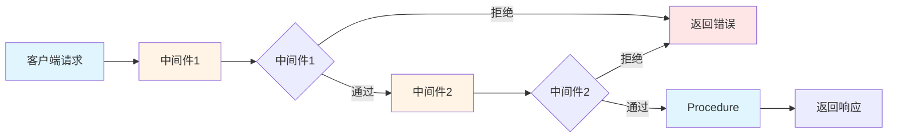

## 前言

在实际项目中，我们需要处理很多**横切关注点**（Cross-cutting Concerns）：

- 用户认证和授权
- 请求日志记录
- 性能监控
- 错误处理和格式化
- 请求验证
- 数据库事务管理

如果每个 Procedure 都要重复写这些逻辑，代码会变得难以维护。tRPC 的**中间件系统**就是为了解决这个问题而设计的。

今天，我们将深入学习：

- tRPC 中间件的工作原理
- 如何创建和使用中间件
- 常见中间件实战（认证、日志、限流）
- 错误处理最佳实践

## 中间件基础

### 什么是中间件？

中间件是一个函数，它可以在 Procedure 执行**之前**和**之后**运行，可以：

- 修改请求的上下文（Context）
- 验证请求
- 处理错误
- 记录日志
- 提前返回响应

### 中间件执行流程



### 创建第一个中间件

```typescript
import { initTRPC, TRPCError } from "@trpc/server";

const t = initTRPC.create();

// ========== 创建简单的日志中间件 ==========

const loggerMiddleware = t.middleware(async ({ path, type, next }) => {
  // 📍 在 Procedure 执行之前
  const start = Date.now();
  console.log(`📥 [${type}] ${path} - 开始处理`);

  // 调用下一个中间件或 Procedure
  const result = await next();

  // 📍 在 Procedure 执行之后
  const duration = Date.now() - start;
  console.log(`📤 [${type}] ${path} - 完成 (${duration}ms)`);

  return result;
});

// 应用中间件到所有 Procedure
export const middleware = t.middleware;
export const logger = loggerMiddleware;
```

### 应用中间件

```typescript
// ========== 方式1：应用到单个 Procedure ==========

const protectedProcedure = t.procedure.use(loggerMiddleware);

const getUser = protectedProcedure
  .input(z.object({ id: z.string() }))
  .query(async ({ input }) => {
    return await db.user.findUnique({
      where: { id: input.id },
    });
  });

// ========== 方式2：创建可重用的 Procedure ==========

// 创建带日志的 Procedure
const loggedProcedure = t.procedure.use(loggerMiddleware);

export const appRouter = t.router({
  users: t.router({
    list: loggedProcedure.query(() => db.user.findMany()),
    byId: loggedProcedure.query(({ input }) =>
      db.user.findUnique({ where: { id: input.id } })
    ),
  }),
});

// ========== 方式3：全局应用 ==========

const t = initTRPC.create({
  middleware: [loggerMiddleware],
});
```

## Context 传递

### 什么是 Context？

Context 是在请求生命周期中共享的数据对象，类似于 Express 的 `req` 对象或 NestJS 的请求作用域。

### 创建带 Context 的中间件

```typescript
// ========== 定义 Context 类型 ==========

interface User {
  id: string;
  name: string;
  email: string;
  role: "admin" | "user";
}

interface Context {
  user: User | null;
  requestId: string;
}

// ========== 创建 Context ==========

const createContext = async (): Promise<Context> => {
  // 从请求中提取用户信息（示例）
  const user = await getCurrentUserFromRequest();

  // 生成请求 ID
  const requestId = crypto.randomUUID();

  return {
    user,
    requestId,
  };
};

// ========== 创建带 Context 的 tRPC 实例 ==========

const t = initTRPC.context<Context>().create();

// ========== 在中间件中使用 Context ==========

const authMiddleware = t.middleware(async ({ ctx, next }) => {
  // ctx 的类型是 Context
  if (!ctx.user) {
    throw new TRPCError({
      code: "UNAUTHORIZED",
      message: "未登录",
    });
  }

  // 可以在 Context 中添加额外信息
  const augmentedCtx = {
    ...ctx,
    // 添加时间戳
    timestamp: new Date(),
  };

  return next({
    ctx: augmentedCtx,
  });
});

// ========== 在 Procedure 中使用 Context ==========

const protectedProcedure = t.procedure.use(authMiddleware);

const getProfile = protectedProcedure.query(async ({ ctx }) => {
  // ctx.user 的类型是 User（非 null）
  // ctx.requestId 的类型是 string

  return {
    user: ctx.user,
    requestId: ctx.requestId,
  };
});
```

## 常见中间件实战

### 1. 认证中间件

```typescript
import { TRPCError } from "@trpc/server";
import { z } from "zod";

// ========== JWT 认证中间件 ==========

import jwt from "jsonwebtoken";

const JWT_SECRET = process.env.JWT_SECRET!;

interface JWTPayload {
  userId: string;
  email: string;
}

// 从请求头中提取 Token
function getTokenFromRequest(headers: Headers): string | null {
  const authHeader = headers.get("authorization");
  if (!authHeader) return null;

  // 支持 "Bearer <token>" 格式
  const parts = authHeader.split(" ");
  if (parts.length === 2 && parts[0] === "bearer") {
    return parts[1];
  }

  return authHeader;
}

// 验证 JWT Token
function verifyToken(token: string): JWTPayload {
  try {
    return jwt.verify(token, JWT_SECRET) as JWTPayload;
  } catch (error) {
    throw new TRPCError({
      code: "UNAUTHORIZED",
      message: "Token 无效或已过期",
    });
  }
}

// 创建认证中间件
export const authMiddleware = t.middleware(async ({ ctx, next }) => {
  // 从请求中获取 Token
  const token = getTokenFromRequest(ctx.req?.headers);

  if (!token) {
    throw new TRPCError({
      code: "UNAUTHORIZED",
      message: "未提供认证令牌",
    });
  }

  // 验证 Token
  const payload = verifyToken(token);

  // 从数据库获取用户信息
  const user = await db.user.findUnique({
    where: { id: payload.userId },
  });

  if (!user) {
    throw new TRPCError({
      code: "UNAUTHORIZED",
      message: "用户不存在",
    });
  }

  // 将用户信息添加到 Context
  return next({
    ctx: {
      ...ctx,
      user,
    },
  });
});

// 创建受保护的 Procedure
export const protectedProcedure = t.procedure.use(authMiddleware);

// 使用示例
export const appRouter = t.router({
  // 公开 API
  health: t.procedure.query(() => ({ status: "ok" })),

  // 需要认证的 API
  users: t.router({
    me: protectedProcedure.query(({ ctx }) => {
      // ctx.user 的类型是 User（非 null）
      return ctx.user;
    }),

    updateProfile: protectedProcedure
      .input(
        z.object({
          name: z.string().optional(),
          email: z.string().email().optional(),
        })
      )
      .mutation(async ({ ctx, input }) => {
        return await db.user.update({
          where: { id: ctx.user.id },
          data: input,
        });
      }),
  }),
});
```

### 2. 角色授权中间件

```typescript
// ========== 角色检查中间件 ==========

type Role = "admin" | "moderator" | "user";

interface Context {
  user: {
    id: string;
    name: string;
    role: Role;
  };
}

// 创建角色检查工厂函数
const createRoleMiddleware = (allowedRoles: Role[]) => {
  return t.middleware(async ({ ctx, next }) => {
    if (!ctx.user) {
      throw new TRPCError({
        code: "UNAUTHORIZED",
        message: "未登录",
      });
    }

    if (!allowedRoles.includes(ctx.user.role)) {
      throw new TRPCError({
        code: "FORBIDDEN",
        message: `需要以下角色之一：${allowedRoles.join(", ")}`,
      });
    }

    return next({
      ctx,
    });
  });
};

// 创建特定角色的 Procedure
export const adminProcedure = t.procedure.use(createRoleMiddleware(["admin"]));

export const moderatorProcedure = t.procedure.use(
  createRoleMiddleware(["admin", "moderator"])
);

// 使用示例
export const appRouter = t.router({
  admin: t.router({
    // 只有管理员可以访问
    deleteUser: adminProcedure
      .input(z.object({ id: z.string() }))
      .mutation(async ({ input }) => {
        return await db.user.delete({
          where: { id: input.id },
        });
      }),

    // 管理员和版主都可以访问
    banUser: moderatorProcedure
      .input(
        z.object({
          userId: z.string(),
          reason: z.string(),
        })
      )
      .mutation(async ({ input }) => {
        return await db.user.update({
          where: { id: input.userId },
          data: { banned: true, banReason: input.reason },
        });
      }),
  }),
});
```

### 3. 日志中间件

```typescript
// ========== 结构化日志中间件 ==========

interface LogContext {
  requestId: string;
  userId?: string;
  path: string;
  type: string;
  duration?: number;
  success?: boolean;
  error?: string;
}

function logToService(context: LogContext) {
  // 发送到日志服务（如 Sentry、DataDog 等）
  console.log(JSON.stringify(context));
}

const loggingMiddleware = t.middleware(async ({ path, type, ctx, next }) => {
  const start = Date.now();
  const requestId = crypto.randomUUID();

  const logContext: LogContext = {
    requestId,
    userId: ctx.user?.id,
    path,
    type,
  };

  try {
    // 记录请求开始
    console.log(`[${requestId}] 📥 ${type} ${path}`);

    // 执行 Procedure
    const result = await next();

    // 记录成功
    logContext.duration = Date.now() - start;
    logContext.success = true;

    console.log(`[${requestId}] ✅ ${type} ${path} (${logContext.duration}ms)`);

    // 发送到日志服务
    logToService(logContext);

    return result;
  } catch (error) {
    // 记录错误
    logContext.duration = Date.now() - start;
    logContext.success = false;
    logContext.error = error instanceof Error ? error.message : "Unknown error";

    console.error(`[${requestId}] ❌ ${type} ${path} - ${logContext.error}`);

    logToService(logContext);

    throw error;
  }
});
```

### 4. 性能监控中间件

```typescript
// ========== 性能监控中间件 ==========

interface PerformanceMetrics {
  path: string;
  type: string;
  duration: number;
  timestamp: Date;
  success: boolean;
}

const metrics: PerformanceMetrics[] = [];

const performanceMiddleware = t.middleware(async ({ path, type, next }) => {
  const start = Date.now();

  try {
    const result = await next();

    // 记录成功请求的性能指标
    metrics.push({
      path,
      type,
      duration: Date.now() - start,
      timestamp: new Date(),
      success: true,
    });

    // 慢查询警告
    const duration = Date.now() - start;
    if (duration > 1000) {
      console.warn(`⚠️  慢查询：${path} 耗时 ${duration}ms`);
    }

    return result;
  } catch (error) {
    // 记录失败请求
    metrics.push({
      path,
      type,
      duration: Date.now() - start,
      timestamp: new Date(),
      success: false,
    });

    throw error;
  }
});

// 查询性能统计
const getStats = t.procedure.query(() => {
  const total = metrics.length;
  const successful = metrics.filter((m) => m.success).length;
  const failed = total - successful;
  const avgDuration = metrics.reduce((sum, m) => sum + m.duration, 0) / total;

  return {
    total,
    successful,
    failed,
    successRate: (successful / total) * 100,
    avgDuration: Math.round(avgDuration),
  };
});
```

### 5. 限流中间件

```typescript
// ========== 限流中间件 ==========

interface RateLimitConfig {
  windowMs: number; // 时间窗口（毫秒）
  maxRequests: number; // 最大请求数
}

const rateLimiter = (config: RateLimitConfig) => {
  const requests = new Map<string, number[]>();

  return t.middleware(async ({ ctx, next }) => {
    const userId =
      ctx.user?.id || ctx.req?.headers.get("x-forwarded-for") || "anonymous";
    const now = Date.now();

    // 获取用户的历史请求时间戳
    let userRequests = requests.get(userId) || [];

    // 清理过期的请求记录
    userRequests = userRequests.filter(
      (timestamp) => now - timestamp < config.windowMs
    );

    // 检查是否超过限制
    if (userRequests.length >= config.maxRequests) {
      throw new TRPCError({
        code: "TOO_MANY_REQUESTS",
        message: `请求过于频繁，请在 ${config.windowMs / 1000} 秒后重试`,
      });
    }

    // 记录当前请求
    userRequests.push(now);
    requests.set(userId, userRequests);

    return next();
  });
};

// 创建限流的 Procedure
export const rateLimitedProcedure = t.procedure.use(
  rateLimiter({ windowMs: 60000, maxRequests: 100 }) // 每分钟100次
);

// 不同用户角色的不同限制
export const userRateLimitedProcedure = t.procedure.use(
  rateLimiter({ windowMs: 60000, maxRequests: 100 })
);

export const adminRateLimitedProcedure = t.procedure.use(
  rateLimiter({ windowMs: 60000, maxRequests: 1000 })
);
```

### 6. 数据库事务中间件

```typescript
// ========== 数据库事务中间件 ==========

const transactionMiddleware = t.middleware(async ({ next }) => {
  // 开始事务
  return await db.$transaction(async (tx) => {
    // 将事务传递给 Procedure
    return next({
      ctx: {
        // 使用 tx 代替 db
        prisma: tx,
      },
    });
  });
});

// 创建需要事务的 Procedure
const transactionalProcedure = t.procedure.use(transactionMiddleware);

// 使用示例
const transferMoney = transactionalProcedure
  .input(
    z.object({
      fromUserId: z.string(),
      toUserId: z.string(),
      amount: z.number().positive(),
    })
  )
  .mutation(async ({ ctx, input }) => {
    const { fromUserId, toUserId, amount } = input;
    const { prisma: tx } = ctx;

    // 两个操作在同一事务中
    const [fromUser, toUser] = await Promise.all([
      tx.user.update({
        where: { id: fromUserId },
        data: { balance: { decrement: amount } },
      }),
      tx.user.update({
        where: { id: toUserId },
        data: { balance: { increment: amount } },
      }),
    ]);

    return { fromUser, toUser };
  });
```

## 错误处理

### TRPCError

tRPC 提供了标准的 `TRPCError` 类，支持 HTTP 标准错误码：

```typescript
import { TRPCError } from "@trpc/server";

// ========== 所有支持的错误码 ==========

const errorExamples = {
  // 客户端错误（4xx）
  BAD_REQUEST: new TRPCError({
    code: "BAD_REQUEST",
    message: "请求参数错误",
  }),

  UNAUTHORIZED: new TRPCError({
    code: "UNAUTHORIZED",
    message: "未授权访问",
  }),

  FORBIDDEN: new TRPCError({
    code: "FORBIDDEN",
    message: "权限不足",
  }),

  NOT_FOUND: new TRPCError({
    code: "NOT_FOUND",
    message: "资源不存在",
  }),

  METHOD_NOT_SUPPORTED: new TRPCError({
    code: "METHOD_NOT_SUPPORTED",
    message: "不支持的请求方法",
  }),

  TIMEOUT: new TRPCError({
    code: "TIMEOUT",
    message: "请求超时",
  }),

  CONFLICT: new TRPCError({
    code: "CONFLICT",
    message: "资源冲突",
  }),

  TOO_MANY_REQUESTS: new TRPCError({
    code: "TOO_MANY_REQUESTS",
    message: "请求过于频繁",
  }),

  // 服务器错误（5xx）
  INTERNAL_SERVER_ERROR: new TRPCError({
    code: "INTERNAL_SERVER_ERROR",
    message: "服务器内部错误",
  }),
};
```

### 错误处理中间件

```typescript
// ========== 全局错误处理中间件 ==========

const errorHandlingMiddleware = t.middleware(async ({ next }) => {
  try {
    return await next();
  } catch (error) {
    // 处理 Prisma 错误
    if (error instanceof Prisma.PrismaClientKnownRequestError) {
      // 唯一约束冲突
      if (error.code === "P2002") {
        throw new TRPCError({
          code: "CONFLICT",
          message: "该记录已存在",
        });
      }

      // 记录不存在
      if (error.code === "P2025") {
        throw new TRPCError({
          code: "NOT_FOUND",
          message: "记录不存在",
        });
      }
    }

    // 处理 Zod 验证错误
    if (error instanceof z.ZodError) {
      throw new TRPCError({
        code: "BAD_REQUEST",
        message: "输入数据验证失败",
        cause: error.errors,
      });
    }

    // 重新抛出 TRPCError
    if (error instanceof TRPCError) {
      throw error;
    }

    // 其他未知错误
    console.error("未处理的错误：", error);
    throw new TRPCError({
      code: "INTERNAL_SERVER_ERROR",
      message: "服务器内部错误",
    });
  }
});

// 应用全局错误处理
const t = initTRPC.create({
  middleware: [errorHandlingMiddleware],
});
```

### 格式化错误响应

```typescript
// ========== 自定义错误格式化 ==========

const t = initTRPC.create({
  errorFormatter({ shape, error }) {
    return {
      ...shape,
      data: {
        ...shape.data,
        // 添加自定义字段
        zodError:
          error.code === "BAD_REQUEST" && error.cause instanceof z.ZodError
            ? error.cause.flatten()
            : null,

        // 添加时间戳
        timestamp: new Date().toISOString(),

        // 添加请求 ID（如果有）
        requestId: error.ctx?.requestId,
      },
    };
  },
});
```

### 客户端错误处理

```typescript
// ========== 客户端错误处理 ==========

import { TRPCClientError } from '@trpc/client';

// 使用 try-catch
try {
  const user = await client.users.byId.query({ id: '123' });
} catch (error) {
  if (error instanceof TRPCClientError) {
    // 处理 tRPC 错误
    switch (error.code) {
      case 'UNAUTHORIZED':
        console.log('请先登录');
        break;
      case 'FORBIDDEN':
        console.log('权限不足');
        break;
      case 'NOT_FOUND':
        console.log('资源不存在');
        break;
      default:
        console.log('发生错误：', error.message);
    }
  }
}

// React Query 的错误处理
function UserProfile({ userId }: { userId: string }) {
  const { data, error } = trpc.users.byId.useQuery({ id: userId });

  if (error) {
    if (error.code === 'NOT_FOUND') {
      return <div>用户不存在</div>;
    }
    if (error.code === 'UNAUTHORIZED') {
      return <div>请先登录</div>;
    }
    return <div>发生错误：{error.message}</div>;
  }

  return <div>{data?.name}</div>;
}
```

## 完整示例：企业级中间件配置

```typescript
// ========== middleware.ts ==========

import { initTRPC, TRPCError } from "@trpc/server";
import { z } from "zod";
import jwt from "jsonwebtoken";
import prisma from "./prisma";

// ========== Context 类型定义 ==========

interface User {
  id: string;
  name: string;
  email: string;
  role: "admin" | "moderator" | "user";
}

export interface Context {
  user: User | null;
  requestId: string;
  req?: Request;
}

// ========== 创建 Context ==========

export const createContext = async (req?: Request): Promise<Context> => {
  // 从 JWT Token 中提取用户
  let user: User | null = null;

  const token = req?.headers.get("authorization")?.replace("Bearer ", "");

  if (token) {
    try {
      const payload = jwt.verify(token, process.env.JWT_SECRET!) as {
        userId: string;
      };

      user = await prisma.user.findUnique({
        where: { id: payload.userId },
      });
    } catch {
      // Token 无效，user 保持为 null
    }
  }

  return {
    user,
    requestId: crypto.randomUUID(),
    req,
  };
};

// ========== 创建 tRPC 实例 ==========

const t = initTRPC.context<Context>().create();

// ========== 1. 日志中间件 ==========

const logger = t.middleware(async ({ path, type, next }) => {
  const start = Date.now();
  const result = await next();

  const duration = Date.now() - start;
  console.log(`[${type}] ${path} - ${duration}ms`);

  if (duration > 1000) {
    console.warn(`⚠️  慢查询：${path} (${duration}ms)`);
  }

  return result;
});

// ========== 2. 认证中间件 ==========

export const auth = t.middleware(async ({ ctx, next }) => {
  if (!ctx.user) {
    throw new TRPCError({
      code: "UNAUTHORIZED",
      message: "未登录",
    });
  }

  return next({
    ctx: {
      ...ctx,
      user: ctx.user, // 非 null 断言
    },
  });
});

// ========== 3. 角色检查中间件 ==========

const createRoleGuard = (roles: User["role"][]) => {
  return t.middleware(async ({ ctx, next }) => {
    if (!ctx.user || !roles.includes(ctx.user.role)) {
      throw new TRPCError({
        code: "FORBIDDEN",
        message: `需要以下角色之一：${roles.join(", ")}`,
      });
    }

    return next();
  });
};

// ========== 4. 错误处理中间件 ==========

const errorHandler = t.middleware(async ({ next }) => {
  try {
    return await next();
  } catch (error) {
    // Prisma 错误处理
    if (error instanceof Prisma.PrismaClientKnownRequestError) {
      if (error.code === "P2002") {
        throw new TRPCError({
          code: "CONFLICT",
          message: "该记录已存在",
        });
      }
      if (error.code === "P2025") {
        throw new TRPCError({
          code: "NOT_FOUND",
          message: "记录不存在",
        });
      }
    }

    // Zod 验证错误
    if (error instanceof z.ZodError) {
      throw new TRPCError({
        code: "BAD_REQUEST",
        message: error.errors.map((e) => e.message).join(", "),
      });
    }

    // 重新抛出 TRPCError
    if (error instanceof TRPCError) {
      throw error;
    }

    // 未知错误
    console.error("未处理的错误：", error);
    throw new TRPCError({
      code: "INTERNAL_SERVER_ERROR",
      message: "服务器内部错误",
    });
  }
});

// ========== 创建可重用的 Procedure ==========

// 公开 API（所有中间件）
export const publicProcedure = t.procedure.use(logger).use(errorHandler);

// 需要认证的 API
export const protectedProcedure = publicProcedure.use(auth);

// 管理员 API
export const adminProcedure = protectedProcedure.use(
  createRoleGuard(["admin"])
);

// 版主及管理员 API
export const moderatorProcedure = protectedProcedure.use(
  createRoleGuard(["admin", "moderator"])
);

// ========== 导出 middleware 和 t ==========

export const middleware = t.middleware;
export const router = t.router;
```

## 最佳实践

### 1. 中间件组织

```typescript
// ✅ 推荐：按功能组织中间件
// middleware/index.ts
export { logger } from "./logger";
export { auth, createRoleGuard } from "./auth";
export { errorHandler } from "./error";
export { rateLimiter } from "./rateLimit";

// router/index.ts
import { logger, auth, errorHandler } from "./middleware";

const t = initTRPC.create({
  middleware: [logger, errorHandler],
});
```

### 2. 中间件顺序

```typescript
// ✅ 正确的中间件顺序
const procedure = t.procedure
  .use(logger) // 1. 记录请求开始
  .use(auth) // 2. 验证身份
  .use(rateLimiter) // 3. 限流
  .query(({ ctx }) => {
    // Procedure 逻辑
  });

// ❌ 错误：顺序不当
const procedure = t.procedure
  .use(rateLimiter) // 先限流
  .use(auth) // 再认证（浪费资源）
  .use(logger) // 最后记录日志（信息不全）
  .query(({ ctx }) => {
    // Procedure 逻辑
  });
```

### 3. 错误消息

```typescript
// ✅ 推荐：清晰、友好的错误消息
throw new TRPCError({
  code: "BAD_REQUEST",
  message: "邮箱格式不正确",
});

// ❌ 避免：技术性的错误消息
throw new TRPCError({
  code: "BAD_REQUEST",
  message: "Validation failed: email must match format",
});

// ✅ 推荐：提供有用的信息
throw new TRPCError({
  code: "FORBIDDEN",
  message: "需要管理员权限才能执行此操作",
});

// ❌ 避免：模糊的错误消息
throw new TRPCError({
  code: "FORBIDDEN",
  message: "Access denied",
});
```

### 4. 类型安全的 Context

```typescript
// ✅ 推荐：使用类型断言
export const protectedProcedure = publicProcedure.use(auth);

const getProfile = protectedProcedure.query(({ ctx }) => {
  // ctx.user 的类型是 User（非 null）
  return ctx.user;
});

// ❌ 避免：手动类型检查
const getProfile = t.procedure.query(({ ctx }) => {
  if (!ctx.user) {
    throw new TRPCError({ code: "UNAUTHORIZED" });
  }
  // ctx.user 的类型仍然是 User | null
  return ctx.user as User;
});
```

## 总结

### 核心要点

1. **中间件系统**
   - 在 Procedure 执行前后运行
   - 可以修改 Context
   - 支持链式调用

2. **Context**
   - 请求生命周期中的共享数据
   - 类型安全的数据传递
   - 支持嵌套和扩展

3. **常见中间件**
   - 认证和授权
   - 日志记录
   - 性能监控
   - 限流保护
   - 事务管理

4. **错误处理**
   - TRPCError 标准错误
   - 全局错误处理
   - 自定义错误格式
   - 客户端错误处理

### 中间件检查清单

- [ ] 日志记录（所有请求）
- [ ] 错误处理（统一格式）
- [ ] 认证检查（保护 API）
- [ ] 授权检查（角色验证）
- [ ] 性能监控（慢查询检测）
- [ ] 限流保护（防止滥用）

### 下一步

现在你已经掌握了 tRPC 的中间件系统，下一篇文章我们将学习：

- **Prisma + tRPC 深度集成**
- **构建类型安全的 CRUD API**
- **复杂查询和关联数据**
- **性能优化技巧**

敬请期待！🚀

## 参考资源

- [tRPC Middleware 文档](https://trpc.io/docs/middlewares)
- [tRPC Error Handling 文档](https://trpc.io/docs/error-handling)
- [HTTP Status Codes](https://developer.mozilla.org/en-US/docs/Web/HTTP/Status)

---

**上一章**：[03. 类型推断与自动补全](./03-type-inference-autocompletion.mdx)
**下一章**：[05. Prisma 集成](./05-prisma-integration.mdx)
